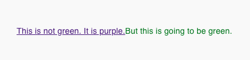
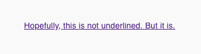

# gatsby-styleless-link

A simple wrapper around `Link` from `gatsby-link` to make 
styling easier.

## Installation

Before installing, make sure `gatsby` is installed. 

If you don't know what [gatsby](https://www.gatsbyjs.org) is, 
then this package is probably not for you.

With yarn,
```
$ yarn add gatsby-styleless-link
```

With npm,
```
$ npm install gatsby-styleless-link
```

## Quick Start 

```jsx
import Link from 'gatsby-styleless-link';

function MyPage() {
    return (
        <div style={{ color: 'blue' }}>
            <Link to="/">
                Link to home that is blue!
            </Link>
        </div>
    );
}
```

## Why?
The default gatsby `Link` component apply its
own default style through user agent stylesheet. 
It will not inherit the property from its parent.
For example,
```jsx
import { Link } from 'gatsby';

//... 

return (
    <span style={{ color: 'green' }}>
        <Link>
            This is is not green. It is purple.
        </Link>
        But this is going to be green.
    </span>
);
```

It will render to something like



We built this component such that the link
can inherit the style from parent component.

This problem still exists if we attempt to 
use inline style to overwrite the style
of a parent `Link` component, it will not work.

```jsx
import { Link } from 'gatsby';

//... 

return (
    <Link>
        {/* Remove underline with inline style */}
        <span style={{ textDecoration: 'none' }}>
            Hopefully, this is not underlined. But it is.
        </span>
    </Link>
);
```

This renders to something like



This is hard to debug. Took me some time
to figure this out. Hence the birth of this 
component.